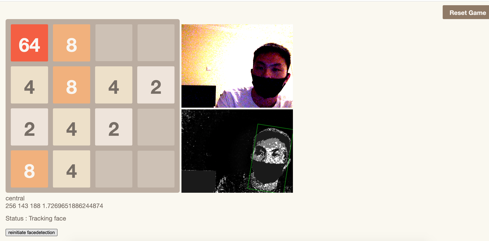

# Rock Your Neck
> rolling your neck to play game 2048

[DEMO](https://huozhi.im/rock-your-neck/)



## Development

```sh
npm install
npm start
# visit localhost:8080
```

Make sure your latop or pc's camera is OPEN and available for web browser

## About

A neck relaxing app for coders. Control you head to move left, right, up and
down to control the fameous web game "2048" but for approaching not high score.

We build this at the hackathon `HackShanghai`.

Team Mates: xhh, winterhouse


## Inspiration

Nowadys people facing to the electric screen for much more time than facing to
their families and friends. We wanna notice them to relax their busy life and
the "hard" neck. Also a small healt notificator based on chrome extension will
remind them of their body status. Hope bring more coder to the reality.
